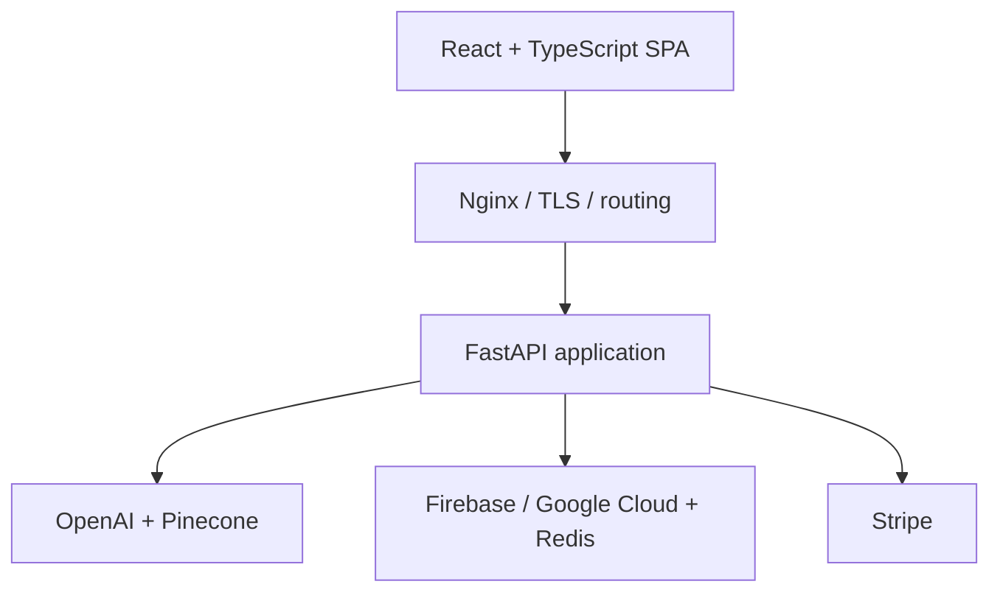

# LexBot Pro

**Production-grade legal AI workspace combining RAG search, document intelligence, agentic workflows, and a complete SaaS delivery stack.**

> **Portfolio status:** LexBot Pro is no longer being pursued as a commercial product. This repository is public as an engineering case study of a substantial full-stack application built and iterated as a real product, rather than as a tutorial or one-off demo.

## What it does

LexBot Pro was designed to help legal professionals work with large document sets through search, AI-assisted analysis, and structured workflows.

The product brings several systems together in one application:

- document ingestion and source-aware RAG search
- dense/sparse retrieval with configurable hybrid fusion
- AI-generated legal workflows with run history, versions, branching, refinement, and partial AI edits
- downloadable workflow artifacts and structured outputs
- OCR for scanned material
- audio transcription with optional diarization
- authentication, user profiles, file management, and usage limits
- subscription billing through Stripe
- PII pseudonymization using Google Cloud DLP/KMS
- background processing and usage accounting with Redis
- production observability with structured request IDs, traces, metrics, and OpenTelemetry
- separate marketing, application, and staging surfaces behind Nginx

## Architecture



The repository contains both product code and the operational pieces needed to run it as an internet-facing service.

## Engineering highlights

### RAG and document intelligence

The backend supports configurable embedding and vector-store implementations, Pinecone-backed retrieval, hybrid search, source-aware responses, and per-user document handling. Retrieval is integrated with usage accounting and a PII tokenization/detokenization layer rather than being isolated as a toy chat endpoint.

### Agentic legal workflows

The workflow subsystem goes beyond a single prompt/response cycle. A workflow run can be persisted, refined, branched, versioned, edited, partially edited with AI, selected as the active version, saved as an artifact, and exported in different formats.

The commit history also captures repeated evaluation-driven changes to context generation, source strictness, clause mapping, decision traces, large-document handling, and workflow presentation.

### Production API

FastAPI is split into feature-level routers for authentication, profiles, chat history, RAG, files, upload tracking, transcription, OCR, workflows, billing, limits, and internal evaluations.

Operational concerns are handled explicitly:

- request and trace IDs
- structured logging
- health checks
- trusted-host and CORS configuration
- background-job lifecycle
- rate/usage limits by plan
- Redis-backed runtime state
- OpenTelemetry instrumentation
- production and staging routing

### SaaS and infrastructure

The application includes the less glamorous parts that turn a feature into a product: authentication, subscriptions, plan limits, billing flows, file lifecycle, monitoring, security headers, deployment configuration, and production/staging separation.

Docker Compose ties together the FastAPI service, Redis, and Nginx. The Nginx configuration provides TLS termination, hardened response headers, static SPA delivery, API proxying, WebSocket routing, and host separation.

## Stack

| Layer | Technology |
| --- | --- |
| Frontend | React 19, TypeScript, Vite, Radix UI, Tailwind CSS |
| Backend | Python 3.11, FastAPI, Pydantic, Uvicorn |
| AI / retrieval | OpenAI, Pinecone, hybrid dense/sparse retrieval |
| Data / auth | Firebase, Google Cloud, Redis |
| Document processing | PDF/DOCX parsing, OCR, transcription |
| Privacy | Google Cloud DLP + KMS pseudonymization |
| Billing | Stripe |
| Observability | OpenTelemetry, structured application logging |
| Infrastructure | Docker Compose, Nginx, TLS, health checks |
| Testing | pytest, pytest-asyncio, pytest-cov, Vitest / Testing Library |

## Repository map

```text
backend/             FastAPI application and feature modules
static/spa/          React/TypeScript application
static/marketing/    Public marketing site
ops/                 Nginx, Redis and deployment configuration
docker-compose.yml   Production-style service composition
```

## Why this repository is public

The commercial thesis behind a product and the engineering required to build it are different questions. LexBot Pro is no longer an active commercial bet, but it remains representative of the kind of software I build: multi-surface applications that connect AI, APIs, data, billing, infrastructure, and product UX into one working system.

The development history documents sustained iteration across product behavior, UI, AI evaluation, reliability, and infrastructure.

## Running it

This is a portfolio case study, not a turnkey hosted product. A complete deployment requires external credentials and services such as Firebase/Google Cloud, OpenAI, Pinecone, Stripe, and Redis.

The frontend can be built from `static/spa`, while the backend is containerized under `backend`. Deployment configuration is included in `docker-compose.yml` and `ops/`.

## About me

I build full-stack software around practical business problems: RAG/search applications, API integrations, automation systems, desktop/mobile tooling, and MVPs.

For more work, see my [GitHub profile](https://github.com/vjurcutiu).
